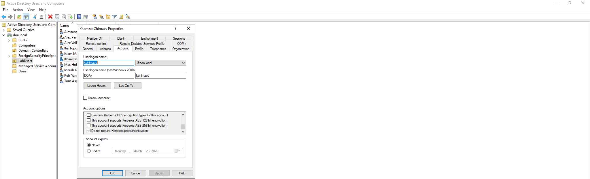
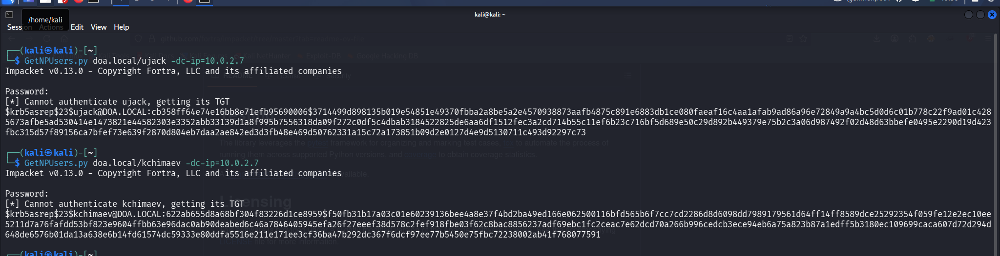

### AS-REP Roasting
This attack is caused by a domain user not having [Kerberos](https://en.hackndo.com/kerberos/) pre-authentication enabled.

## Attack Demo

**Step 1 — Disable Pre-Authentication**

On the domain controller, disable pre-authentication using the [Disable-KerbPreAuth.ps1](https://github.com/davidonlinearchive/Active-Directory-Lab/blob/main/Attacks/AS-REP-Roasting/Disable-KerbPreAuth.ps1) script, which randomly selects 2 users and disables their pre-authentication.


Looks like `ujack` and `kchimaev` were randomly selected (natural selection, I guess). To verify, checking the user properties confirms the **"Do Not Require Kerberos Pre-Authentication"** flag is checked.



---

**Step 2 — Install Impacket on Attack Machine**

On the dedicated attack machine, install [Impacket](https://github.com/fortra/impacket) via:
```bash
python3 -m pipx install impacket
```

---

**Step 3 — Retrieve Hashes with GetNPUsers.py**

`GetNPUsers.py` retrieves hashes for users who have **"Do Not Require Kerberos Pre-Authentication"** set, without needing their passwords.

Syntax:
```bash
GetNPUsers.py <domain>/<user> -dc-ip <x.x.x.x>
```

Since both `ujack` and `kchimaev` had pre-authentication disabled, run:
```bash
GetNPUsers.py doa.local/ujack -dc-ip=10.0.2.7
GetNPUsers.py doa.local/kchimaev -dc-ip=10.0.2.7
```



---

**Step 4 — Crack the Hashes**

With the AS-REP hashes retrieved, crack them offline to recover the plaintext passwords:

| User | Password |
|------|----------|
| ujack | Changme123! |
| kchimaev | BorzBorz7 |